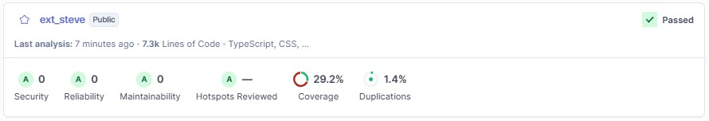

# Fanafodiko

### Prérequis

Avant de commencer, assurez-vous d'avoir installé :
- [Node.js](https://nodejs.org/) (version >= 18)
- [pnpm](https://pnpm.io/) (version >= 8)
- [Bun](https://bun.sh/) (utilisé pour le backend)
- [MongoDB](https://www.mongodb.com/) (local ou Atlas)
- [Resend](https://resend.com/)

Si vous utiliser Docker assurez vous d'avoir : 
- [Docker](https://www.docker.com/)

### 1. Installation des dépendances

À la racine du projet, exécutez :

```bash
pnpm install
```

### 2. Configuration

Copiez le fichier d'exemple d'environnement dans le dossier backend :

```bash
cp apps/backend/.env.example apps/backend/.env
```

Éditez `apps/backend/.env` pour configurer vos variables (notamment `MONGODB_URI` et `RESEND_API_KEY`).

Copiez le fichier d'exemple d'environnement dans le dossier frontend :

```bash
cp apps/frontend/.env.example apps/frontend/.env
```

Éditez `apps/frontend/.env` pour configurer vos variables (`VITE_API_URL`).


### 3. Lancement en mode développement (Sans Docker)

Pour lancer simultanément le frontend et le backend :

```bash
pnpm dev
```

- **Frontend :** Accaccessible sur `http://localhost:5173`
- **Backend :** Accessible sur `http://localhost:3000`

### 4. Lancement avec Docker (Recommandé)

Le projet utilise une image **Linux (Debian)** contenant MongoDB, Bun et Node.js.

1. **Prérequis** : Docker Desktop lancé.
2. **Lancement** :

   ```shell
      docker-compose up --build
   ```

- **Frontend :** `http://localhost:5173`
- **Backend :** `http://localhost:3000`
- **Données persistantes :** Stockées dans le volume `mongodb_data` et le dossier `./apps/backend/uploads`.

### 5. Tests & Couverture

Pour lancer les tests sur l'ensemble du monorepo :

```bash
pnpm test
```

Cette commande génère un dossier `coverage/` à la racine de chaque application (notamment `apps/backend`) contenant les rapports au format LCOV.

### 6. Analyse de code (SonarQube)

Le projet est configuré pour l'analyse de code avec SonarQube.

1. **Configuration** : Copiez le fichier d'exemple et renseignez votre token si nécessaire :
   ```bash
   cp sonar-project.properties.example sonar-project.properties
   ```
2. **Lancement** : Assurez-vous que votre serveur SonarQube est lancé, puis exécutez :
   ```bash
   pnpm sonar
   ```

### 7. Résultats de l'analyse SonarQube

Voici les résultats obtenus lors de la dernière analyse du projet :



---

## Architecture du Projet

Le projet est structuré en tant que monorepo géré avec **Turborepo** et **pnpm**.

- `apps/frontend` : SPA React avec Vite, Tailwind CSS et Shadcn UI.
- `apps/backend` : API REST en DDD avec Hono et Bun, utilisant Mongoose pour MongoDB.
- `packages/` : Contient les schémas Zod partagés, les types et les utilitaires.

---

## Choix Techniques

- **Domain-Driven Design (DDD)** : Architecture logicielle permettant de maintenir une logique métier claire, testable et isolée des détails d'infrastructure.
- **Monorepo (Turborepo + pnpm)** : Structure unifiée permettant le partage de types et de logique entre le frontend et le backend, facilitant le développement et la cohérence des données.
- **Backend (Bun + Hono)** : Utilisation de **Bun** comme moteur d'exécution pour ses performances exceptionnelles et de **Hono** pour sa légèreté et son support natif des standards Web.
- **Database (Mongoose)** : Choix de MongoDB pour sa flexibilité. Grâce à l'architecture DDD, l'implémentation du Repository est facilement interchangeable (vers SQL/PostgreSQL par exemple) sans toucher au domaine.
- **Frontend (React + Vite + Shadcn UI)** : Stack moderne pour une interface utilisateur rapide, typée et esthétique.

---

## Philosophie Technique

- **Domain-Driven Design (DDD) :** Séparation stricte de la logique métier, de l'orchestration et de l'infrastructure.
- **Typesafe :** Partage des schémas de validation (Zod) entre le frontend et le backend.
- **Performance :** Utilisation de Bun pour un backend ultra-rapide.
